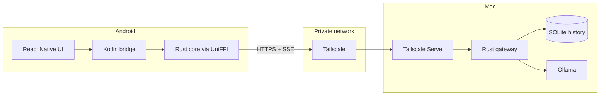

# Bridge

Bridge is a private Android chat client for open weight models running through Ollama on your Mac. The Mac hosts a Rust gateway and SQLite history; the Android app uses a Rust networking core through UniFFI; the UI is React Native.

> [!NOTE]
> Bridge only work with Android + MacOS.

<br>

## How it works



- The Mac does the heavy lifting (e.g., server-side logic). It runs the gateway as a launchd background service, keeps the full chat history in a local SQLite database, and hosts the models through Ollama.

- The phone is a thin client: the React Native UI talks to a Rust networking core through Kotlin and UniFFI. The core sends requests to the gateway and receives the model's reply as a live token stream over server-sent events.

The app works exactly when it can reach your Mac: on the same network, or from anywhere in the world through your private Tailscale network, as long as the Mac is awake and running. When the Mac is unreachable, you can't chat or browse past conversations until the connection is back.

<br>

## Security

Bridge keeps inference and application data on hardware you control. Ollama runs the model on the Mac, chat history is stored in SQLite on the Mac, and the Android app only renders the UI and exchanges messages with the gateway.

The gateway listens on `127.0.0.1:8787` by default, so it is not directly reachable from the Mac's LAN or the public internet. Tailscale Serve exposes that loopback service only inside your private tailnet through a stable `https://<machine>.<tailnet>.ts.net` address.

Reaching the gateway requires two independent things:

1. The device must be authorized to reach the Mac through Tailscale.
2. The client must present the Bridge API token on every request.

<br>

## Installation

> [!WARNING]
> Installation is complicated at the moment.

- **1. Install the macOS prerequisites.** Install [Homebrew](https://brew.sh/) first, then install the command-line tools, Java, Ollama, Tailscale, and the Android SDK tools:

  ```bash
  brew install git just bun rustup ollama
  brew install --cask temurin android-commandlinetools tailscale-app
  ```

  Add Rust and the Android tools to your shell path:

  ```bash
  echo 'export PATH="$(brew --prefix rustup)/bin:$PATH"' >> ~/.zshrc
  echo 'export ANDROID_HOME="$(brew --prefix)/share/android-commandlinetools"' >> ~/.zshrc
  echo 'export PATH="$ANDROID_HOME/platform-tools:$ANDROID_HOME/cmdline-tools/latest/bin:$PATH"' >> ~/.zshrc
  source ~/.zshrc
  rustup default stable
  ```

- **2. Install the required Android packages.** Accept the Android licenses when prompted:

  ```bash
  sdkmanager "platform-tools" "platforms;android-36" "build-tools;35.0.1" "ndk;27.3.13750724" "cmake;3.22.1"
  sdkmanager --licenses
  ```

- **3. Clone Bridge and install its dependencies.**

  ```bash
  git clone https://github.com/JosephBARBIERDARNAL/bridge.git
  cd bridge
  just install
  ```

- **4. Start Ollama and download the configured model.** The gateway expects `gemma4:26b` by default:

  ```bash
  brew services start ollama
  ollama pull gemma4:26b
  ```

- **5. Connect the Mac to Tailscale.** Open the Tailscale app, sign in, and confirm that the Mac appears in your tailnet.

- **6. Install the Bridge gateway on the Mac.** This builds the Rust gateway, installs it as a persistent `launchd` background service, generates the API token, and configures Tailscale Serve:

  ```bash
  just mac-install
  just status
  ```

  Retrieve the two values needed by Android:

  ```bash
  tailscale serve status
  cat "$HOME/Library/Application Support/Bridge/token"
  ```

  Keep the displayed `https://<machine>.<tailnet>.ts.net` URL and API token private.

- **7. Prepare the Android phone.** Install Tailscale from Google Play, sign in to the same tailnet, and enable **Developer options → USB debugging** in Android settings.

- **8. Connect and authorize the phone.** Connect it to the Mac by USB, accept the debugging authorization prompt on the phone, and verify the connection:

  ```bash
  adb devices
  ```

  The device should appear with the status `device`, not `unauthorized`.

- **9. Build and install Bridge on Android.** The debug APK is automatically signed and standalone; it does not require Metro or a release keystore:

  ```bash
  just android
  ```

- **10. Configure Bridge.** Open the app, enter the Tailscale HTTPS URL and API token from step 6, then tap **Save and test**. After the connection succeeds, the USB cable can be disconnected. Bridge will continue working whenever Tailscale is connected and the Mac is awake with Ollama and the gateway running.

To install later updates, reconnect the phone and run `just android` again.
