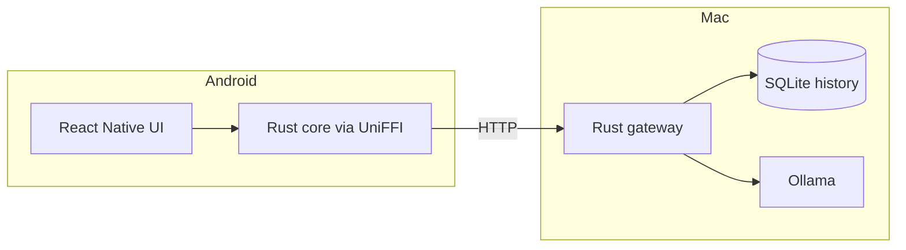

# Bridge

Bridge is a private Android chat client for open weight models running through Ollama on your Mac. The Mac hosts a Rust gateway and SQLite history; the Android app uses a Rust networking core through UniFFI; the UI is React Native and TypeScript with an instant browser preview.

> [!NOTE]
> Bridge only work with Android + MacOS.

 

## How it works

The Mac does the heavy lifting (e.g., server-side logic). It runs the gateway as a launchd background service, keeps the full chat history in a local SQLite database, and hosts the models through Ollama.

The phone is a thin client: the React Native UI talks to a Rust networking core (shared with the browser preview through UniFFI), which sends requests to the gateway and receives the model's reply as a live token stream over server-sent events.

The app works exactly when it can reach your Mac: on the same network, or from anywhere in the world through your private Tailscale network, as long as the Mac is awake and running. When the Mac is unreachable, you can't chat or browse past conversations until the connection is back.

Because access is just "be on the tailnet and hold the API token", you aren't limited to one phone — any Android device you sign into your Tailscale network can use the same gateway and see the same chat history.

