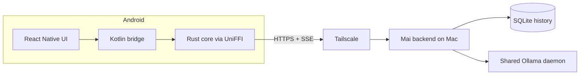

# Bridge

Bridge is a private Android chat client for open-weight models. It connects over HTTPS and server-sent events to the separately deployed [Mai backend](https://github.com/y-sunflower/mai), which stores chat history and uses a shared Ollama daemon on your Mac.

> [!NOTE]
> Bridge only supports an Android client with a macOS-hosted Mai backend.

 

## How it works

The phone is a thin client. The React Native UI calls a Rust networking core through Kotlin and UniFFI; that core sends authenticated requests to Mai and receives live response streams. Chat history stays on the backend and is available whenever the phone can reach the Mac through Tailscale.

> Security: Bridge requires HTTPS for every non-loopback backend URL. Reaching the backend requires both access to the private Tailscale network and the Mai bearer token, which the app stores in Android's credential storage.

