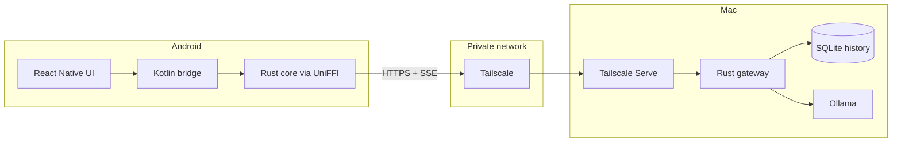

# Bridge

Bridge is a private Android chat client for open weight models running through Ollama on your Mac. The Mac hosts a Rust gateway and SQLite history; the Android app uses a Rust networking core through UniFFI; the UI is React Native.

> [!NOTE]
> Bridge only work with Android + MacOS.

 

## How it works

- The Mac does the heavy lifting (e.g., server-side logic). It runs the gateway as a launchd background service, keeps the full chat history in a local SQLite database, and hosts the models through Ollama.

- The phone is a thin client: the React Native UI talks to a Rust networking core (shared with the browser preview through UniFFI), which sends requests to the gateway and receives the model's reply as a live token stream over server-sent events.

The app works exactly when it can reach your Mac: on the same network, or from anywhere in the world through your private Tailscale network, as long as the Mac is awake and running. When the Mac is unreachable, you can't chat or browse past conversations until the connection is back.

 

## Security

Bridge keeps inference and application data on hardware you control. Ollama runs the model on the Mac, chat history is stored in SQLite on the Mac, and the Android app only renders the UI and exchanges messages with the gateway.

The gateway listens on `127.0.0.1:8787` by default, so it is not directly reachable from the Mac's LAN or the public internet. Tailscale Serve exposes that loopback service only inside your private tailnet through a stable `https://<machine>.<tailnet>.ts.net` address.

Reaching the gateway requires two independent things:

1. The device must be authorized to reach the Mac through Tailscale.
2. The client must present the Bridge API token on every request.

`just mac-install` generates a random 32-byte token and stores it in a Mac user-only file. On Android, the token is encrypted with AES-GCM using a key held by Android Keystore. The Rust Android client rejects non-HTTPS remote gateway URLs, preventing accidental cleartext transmission of messages or credentials.
