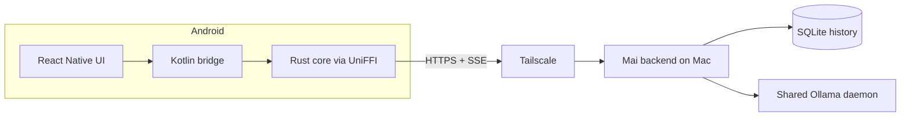

# Bridge

Bridge is a private Android chat client for open-weight models. It connects over HTTPS and server-sent events to the separately deployed [Mai backend](https://github.com/JosephBARBIERDARNAL/mai), which stores chat history and uses a shared Ollama daemon on your Mac.

> [!NOTE]
> Bridge currently supports an Android client with a macOS-hosted Mai backend.

## How it works



The phone is a thin client. The React Native UI calls a Rust networking core through Kotlin and UniFFI; that core sends authenticated requests to Mai and receives live response streams. Chat history stays on the backend and is available whenever the phone can reach the Mac through Tailscale.

## Security

Bridge requires HTTPS for every non-loopback backend URL. Reaching the backend requires both access to the private Tailscale network and the Mai bearer token, which the app stores in Android's credential storage.

Keep the backend URL and token private. Never add them to this repository or package them into an APK.

## Prerequisites

Install and configure [Mai](https://github.com/JosephBARBIERDARNAL/mai) on the Mac first. Keep its Tailscale HTTPS URL and API token for the app configuration step.

For Android development on macOS, install Homebrew and then:

```bash
brew install git just bun rustup
brew install --cask temurin android-commandlinetools
```

Add Rust and the Android tools to your shell path:

```bash
echo 'export PATH="$(brew --prefix rustup)/bin:$PATH"' >> ~/.zshrc
echo 'export ANDROID_HOME="$(brew --prefix)/share/android-commandlinetools"' >> ~/.zshrc
echo 'export PATH="$ANDROID_HOME/platform-tools:$ANDROID_HOME/cmdline-tools/latest/bin:$PATH"' >> ~/.zshrc
source ~/.zshrc
rustup default stable
```

Install the required Android packages and accept the licenses:

```bash
sdkmanager "platform-tools" "platforms;android-36" "build-tools;35.0.1" "ndk;27.3.13750724" "cmake;3.22.1"
sdkmanager --licenses
```

## Development setup

Clone Bridge and install its dependencies:

```bash
git clone https://github.com/JosephBARBIERDARNAL/bridge.git
cd bridge
just install
```

Run the project checks with:

```bash
just fmt
just check
just test
just android-build
```

## Install on Android

1. Install Tailscale on the phone and sign in to the same tailnet as the Mac running Mai.
2. Enable **Developer options → USB debugging** on the phone.
3. Connect and authorize the phone, then verify it is available:

   ```bash
   adb devices
   ```

4. Build and install the standalone debug APK:

   ```bash
   just android
   ```

5. Open Bridge and enter the Mai Tailscale HTTPS URL and API token. Tap **Save and test**.

After configuration, Bridge works whenever the phone can reach the Mac and Mai can reach the shared Ollama daemon. Reconnect the phone and run `just android` to install later client updates.

## Release APK

Copy `apps/bridge/android/keystore.properties.example` to `keystore.properties`, configure a local signing keystore, and run:

```bash
just apk
```

Keystores, signing properties, APKs, and app credentials must remain local and uncommitted.
